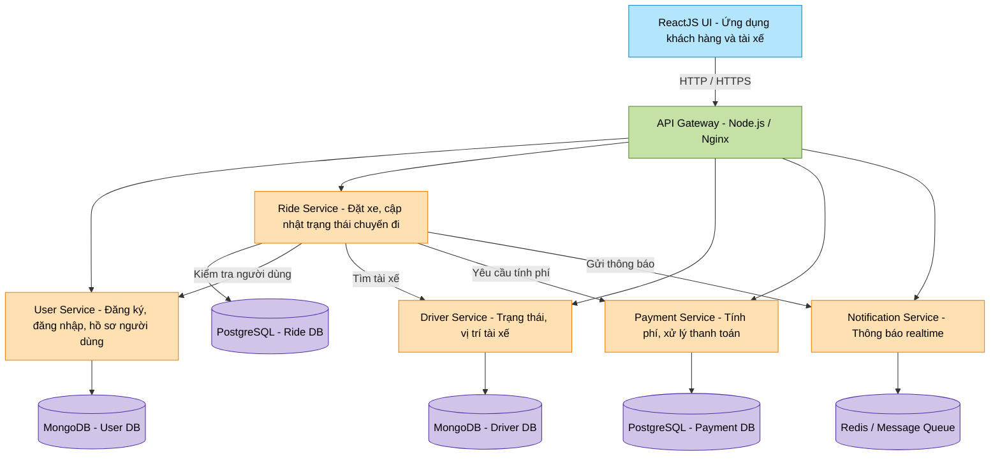
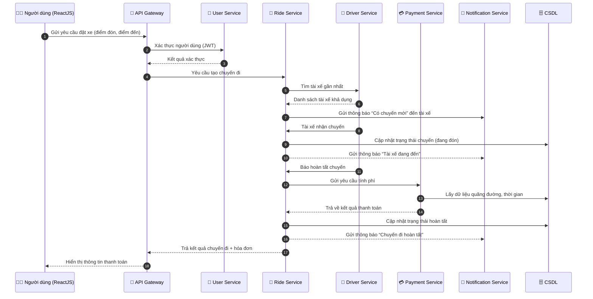

# 🧱 Chương 3: Thiết kế kiến trúc hệ thống

## 3.1. Mục tiêu thiết kế

Hệ thống được xây dựng nhằm cung cấp một **ứng dụng đặt xe taxi trực tuyến** (tương tự Grab, Be hoặc Gojek ở mức cơ bản) giúp kết nối **người dùng** và **tài xế** theo thời gian thực.
Qua đó, hệ thống nhằm giúp người dùng đặt xe, tài xế nhận chuyến và hệ thống quản lý được toàn bộ quá trình hoạt động.
Kiến trúc hệ thống được thiết kế theo **mô hình Microservices**, với mục tiêu:

- Tăng khả năng **mở rộng** và **bảo trì**.  
- Cho phép **triển khai độc lập** từng thành phần.  
- Dễ dàng tích hợp thêm **chức năng mới** mà không ảnh hưởng đến toàn bộ hệ thống.  
- Đảm bảo **hiệu năng cao**, **phản hồi nhanh**, **dễ mở rộng theo chiều ngang (scaling)**.

🏗️ Yêu cầu kỹ thuật

- Frontend: React.js (SPA, giao diện người dùng thân thiện, realtime cập nhật trạng thái chuyến đi)
- Backend: Node.js + Express.js
- Kiến trúc: Microservices (mỗi service đảm nhiệm một chức năng riêng biệt)
- Cơ sở dữ liệu: MongoDB hoặc PostgreSQL
- Giao tiếp giữa các service: REST API hoặc Message Queue (Kafka/RabbitMQ – nếu có thể)
- Authentication: JWT hoặc OAuth 2.0
- Triển khai: Docker / Docker Compose / Docker Swarm

---

## 3.2. Kiến trúc tổng thể của hệ thống

Hệ thống được chia thành hai phần chính:

1. **Frontend (Giao diện người dùng):**  
   - Xây dựng bằng **ReactJS**.  
   - Cho phép người dùng (khách hàng và tài xế) thực hiện các thao tác: đăng nhập, đặt xe, theo dõi trạng thái chuyến đi, xem hóa đơn.  

2. **Backend (Hệ thống dịch vụ):**  
   - Phát triển bằng **Node.js + Express.js**.  
   - Sử dụng **kiến trúc Microservices** gồm nhiều service độc lập giao tiếp qua **REST API** hoặc **Message Queue**.  
   - Dữ liệu được lưu trữ riêng biệt cho từng service (MongoDB hoặc PostgreSQL).  

---

## 3.3. Sơ đồ kiến trúc hệ thống (Block Diagram)

### 🔍 Giải thích sơ đồ
- **ReactJS UI**: Giao diện người dùng, nơi người dùng đặt xe và theo dõi chuyến đi.  
- **API Gateway**: Cửa ngõ trung gian điều phối các request từ frontend tới các service backend, đồng thời xác thực JWT.  
- **User Service**: Quản lý thông tin, đăng nhập/đăng ký người dùng và tài xế.  
- **Ride Service**: Xử lý logic đặt xe, tìm tài xế phù hợp, cập nhật trạng thái chuyến đi.  
- **Driver Service**: Lưu trữ vị trí, trạng thái online/offline của tài xế.  
- **Payment Service**: Tính toán giá cước và xử lý thanh toán (thật hoặc giả lập).  
- **Notification Service**: Gửi thông báo realtime đến người dùng và tài xế qua Socket.io hoặc MQTT.  
- **Database Layer**: Mỗi service có cơ sở dữ liệu riêng biệt, đảm bảo tính độc lập.

---

## 3.4. Sơ đồ luồng dữ liệu (Sequence Diagram)

---

## 3.5. Tóm tắt kiến trúc

| Thành phần | Chức năng chính | Công nghệ sử dụng |
|-------------|----------------|------------------|
| **ReactJS UI** | Giao diện đặt xe, hiển thị realtime | ReactJS, TailwindCSS |
| **API Gateway** | Điều phối request, xác thực, cân bằng tải | Node.js, Express, Nginx |
| **User Service** | Đăng ký, đăng nhập, thông tin người dùng | Node.js, MongoDB |
| **Driver Service** | Quản lý tài xế, trạng thái, vị trí | Node.js, MongoDB |
| **Ride Service** | Đặt xe, trạng thái chuyến, thống kê | Node.js, PostgreSQL |
| **Payment Service** | Tính phí, xử lý thanh toán | Node.js, Stripe/MoMo API |
| **Notification Service** | Thông báo realtime | Socket.io / MQTT |
| **Database Layer** | Lưu trữ dữ liệu riêng cho từng service | MongoDB / PostgreSQL |
| **Triển khai** | Tách biệt từng service, dễ mở rộng | Docker / Docker Compose |

---

## 3.6. Kết luận chương

Kiến trúc Microservices giúp hệ thống:
- Dễ mở rộng và bảo trì.  
- Đảm bảo tính ổn định khi có sự cố ở một service.  
- Linh hoạt trong việc tích hợp các công nghệ mới (thanh toán, bản đồ, AI gợi ý tài xế).  
- Tạo nền tảng vững chắc để phát triển ứng dụng đặt xe trong môi trường thực tế.
