# 🧱 Chương 3: Thiết kế kiến trúc hệ thống

## 3.1. Mục tiêu thiết kế

Hệ thống được xây dựng nhằm cung cấp một **ứng dụng đặt xe taxi trực tuyến** (tương tự Grab, Be hoặc Gojek ở mức cơ bản) giúp kết nối **người dùng** và **tài xế** theo thời gian thực.  
Kiến trúc hệ thống được thiết kế theo **mô hình Microservices**, với mục tiêu:

- Tăng khả năng **mở rộng** và **bảo trì**.  
- Cho phép **triển khai độc lập** từng thành phần.  
- Dễ dàng tích hợp thêm **chức năng mới** mà không ảnh hưởng đến toàn bộ hệ thống.  
- Đảm bảo **hiệu năng cao**, **phản hồi nhanh**, **dễ mở rộng theo chiều ngang (scaling)**.

---

## 3.2. Kiến trúc tổng thể của hệ thống

Hệ thống được chia thành hai phần chính:

1. **Frontend (Giao diện người dùng):**  
   - Xây dựng bằng **ReactJS**.  
   - Cho phép người dùng (khách hàng và tài xế) thực hiện các thao tác: đăng nhập, đặt xe, theo dõi trạng thái chuyến đi, xem hóa đơn.  

2. **Backend (Hệ thống dịch vụ):**  
   - Phát triển bằng **Node.js + Express.js**.  
   - Sử dụng **kiến trúc Microservices** gồm nhiều service độc lập giao tiếp qua **REST API** hoặc **Message Queue**.  
   - Dữ liệu được lưu trữ riêng biệt cho từng service (MongoDB hoặc PostgreSQL).  

---

## 3.3. Sơ đồ kiến trúc hệ thống (Block Diagram)

graph TD
    A[🧑‍💻 ReactJS UI<br/>(Ứng dụng khách hàng & tài xế)] -->|HTTP / HTTPS| B[🚪 API Gateway<br/>(Node.js / Nginx)]

    B --> C1[👤 User Service<br/>(Đăng ký, đăng nhập, hồ sơ người dùng)]
    B --> C2[🚗 Ride Service<br/>(Đặt xe, cập nhật trạng thái chuyến đi)]
    B --> C3[🧭 Driver Service<br/>(Trạng thái, vị trí tài xế)]
    B --> C4[💳 Payment Service<br/>(Tính phí, xử lý thanh toán)]
    B --> C5[🔔 Notification Service<br/>(Thông báo realtime – Socket.io/MQTT)]

    C1 --> D1[(🗄️ MongoDB<br/>User DB)]
    C2 --> D2[(🗄️ PostgreSQL<br/>Ride DB)]
    C3 --> D3[(🗄️ MongoDB<br/>Driver DB)]
    C4 --> D4[(🗄️ PostgreSQL<br/>Payment DB)]
    C5 --> D5[(🗄️ Redis / Message Queue)]

    C2 -->|Kiểm tra người dùng| C1
    C2 -->|Tìm tài xế| C3
    C2 -->|Yêu cầu tính phí| C4
    C2 -->|Gửi thông báo| C5

    classDef frontend fill:#b3e5fc,stroke:#0288d1,color:#000;
    classDef gateway fill:#c5e1a5,stroke:#558b2f,color:#000;
    classDef service fill:#ffe0b2,stroke:#f57c00,color:#000;
    classDef db fill:#d1c4e9,stroke:#512da8,color:#000;

    class A frontend
    class B gateway
    class C1,C2,C3,C4,C5 service
    class D1,D2,D3,D4,D5 db
```

### 🔍 Giải thích sơ đồ
- **ReactJS UI**: Giao diện người dùng, nơi người dùng đặt xe và theo dõi chuyến đi.  
- **API Gateway**: Cửa ngõ trung gian điều phối các request từ frontend tới các service backend, đồng thời xác thực JWT.  
- **User Service**: Quản lý thông tin, đăng nhập/đăng ký người dùng và tài xế.  
- **Ride Service**: Xử lý logic đặt xe, tìm tài xế phù hợp, cập nhật trạng thái chuyến đi.  
- **Driver Service**: Lưu trữ vị trí, trạng thái online/offline của tài xế.  
- **Payment Service**: Tính toán giá cước và xử lý thanh toán (thật hoặc giả lập).  
- **Notification Service**: Gửi thông báo realtime đến người dùng và tài xế qua Socket.io hoặc MQTT.  
- **Database Layer**: Mỗi service có cơ sở dữ liệu riêng biệt, đảm bảo tính độc lập.

---

## 3.4. Sơ đồ luồng dữ liệu (Sequence Diagram)

```mermaid
sequenceDiagram
    autonumber
    participant U as 🧑‍💻 Người dùng (ReactJS)
    participant G as 🚪 API Gateway
    participant US as 👤 User Service
    participant RS as 🚗 Ride Service
    participant DS as 🧭 Driver Service
    participant PS as 💳 Payment Service
    participant NS as 🔔 Notification Service
    participant DB as 🗄️ CSDL

    U->>G: Gửi yêu cầu đặt xe (điểm đón, điểm đến)
    G->>US: Xác thực người dùng (JWT)
    US-->>G: Kết quả xác thực
    G->>RS: Yêu cầu tạo chuyến đi

    RS->>DS: Tìm tài xế gần nhất
    DS-->>RS: Danh sách tài xế khả dụng
    RS->>NS: Gửi thông báo “Có chuyến mới” đến tài xế
    DS->>RS: Tài xế nhận chuyến
    RS->>DB: Cập nhật trạng thái chuyến (đang đón)
    RS-->>NS: Gửi thông báo “Tài xế đang đến”

    DS->>RS: Báo hoàn tất chuyến
    RS->>PS: Gửi yêu cầu tính phí
    PS->>DB: Lấy dữ liệu quãng đường, thời gian
    PS-->>RS: Trả về kết quả thanh toán
    RS->>DB: Cập nhật trạng thái hoàn tất
    RS-->>NS: Gửi thông báo “Chuyến đi hoàn tất”
    RS-->>G: Trả kết quả chuyến đi + hóa đơn
    G-->>U: Hiển thị thông tin thanh toán
```



---

## 3.5. Tóm tắt kiến trúc

| Thành phần | Chức năng chính | Công nghệ sử dụng |
|-------------|----------------|------------------|
| **ReactJS UI** | Giao diện đặt xe, hiển thị realtime | ReactJS, TailwindCSS |
| **API Gateway** | Điều phối request, xác thực, cân bằng tải | Node.js, Express, Nginx |
| **User Service** | Đăng ký, đăng nhập, thông tin người dùng | Node.js, MongoDB |
| **Driver Service** | Quản lý tài xế, trạng thái, vị trí | Node.js, MongoDB |
| **Ride Service** | Đặt xe, trạng thái chuyến, thống kê | Node.js, PostgreSQL |
| **Payment Service** | Tính phí, xử lý thanh toán | Node.js, Stripe/MoMo API |
| **Notification Service** | Thông báo realtime | Socket.io / MQTT |
| **Database Layer** | Lưu trữ dữ liệu riêng cho từng service | MongoDB / PostgreSQL |
| **Triển khai** | Tách biệt từng service, dễ mở rộng | Docker / Docker Compose |

---

## 3.6. Kết luận chương

Kiến trúc Microservices giúp hệ thống:
- Dễ mở rộng và bảo trì.  
- Đảm bảo tính ổn định khi có sự cố ở một service.  
- Linh hoạt trong việc tích hợp các công nghệ mới (thanh toán, bản đồ, AI gợi ý tài xế).  
- Tạo nền tảng vững chắc để phát triển ứng dụng đặt xe trong môi trường thực tế.
