# 🧱 Chương 3: Thiết kế kiến trúc hệ thống

## 3.1. Mục tiêu thiết kế

Hệ thống được xây dựng nhằm cung cấp một **ứng dụng đặt xe taxi trực tuyến** (tương tự Grab, Be hoặc Gojek ở mức cơ bản) giúp kết nối **người dùng** và **tài xế** theo thời gian thực.
Qua đó, hệ thống nhằm giúp người dùng đặt xe, tài xế nhận chuyến và hệ thống quản lý được toàn bộ quá trình hoạt động.
Kiến trúc hệ thống được thiết kế theo **mô hình Microservices**, với mục tiêu:

- Tăng khả năng **mở rộng** và **bảo trì**.  
- Cho phép **triển khai độc lập** từng thành phần.  
- Dễ dàng tích hợp thêm **chức năng mới** mà không ảnh hưởng đến toàn bộ hệ thống.  
- Đảm bảo **hiệu năng cao**, **phản hồi nhanh**, **dễ mở rộng theo chiều ngang (scaling)**.

🏗️ Yêu cầu kỹ thuật

- Frontend: React.js (SPA, giao diện người dùng thân thiện, realtime cập nhật trạng thái chuyến đi)
- Backend: Node.js + Express.js
- Kiến trúc: Microservices (mỗi service đảm nhiệm một chức năng riêng biệt)
- Cơ sở dữ liệu: MongoDB hoặc PostgreSQL
- Giao tiếp giữa các service: REST API hoặc Message Queue (Kafka/RabbitMQ – nếu có thể)
- Authentication: JWT hoặc OAuth 2.0
- Triển khai: Docker / Docker Compose / Docker Swarm

⚙️ Các thành phần Microservices đề xuất

1. User Service
   . Đăng ký, đăng nhập, quản lý thông tin người dùng (khách hàng & tài xế).
   . Xác thực và phân quyền (role-based).
2. Ride Service
   . Xử lý logic đặt xe: tìm tài xế gần nhất, tạo yêu cầu chuyến đi, cập nhật trạng thái chuyến.
   . Theo dõi vị trí theo thời gian thực (WebSocket hoặc MQTT).
3. Driver Service
   . Quản lý hồ sơ tài xế, trạng thái (online/offline), vị trí hiện tại.
   . Nhận hoặc từ chối chuyến đi.
4. Payment Service
   . Tính toán chi phí chuyến đi dựa trên quãng đường, thời gian.
   . Tích hợp thanh toán (giả lập hoặc sử dụng cổng thật như Stripe, MoMo sandbox).
5. Notification Service
   . Gửi thông báo realtime (socket.io hoặc email/SMS giả lập).
6. Gateway Service (API Gateway)
   . Trung gian giữa frontend và các microservice backend.
   . Quản lý routing, xác thực token và cân bằng tải.

💡 Chức năng chính

1. Người dùng:
   . Đăng nhập / Đăng ký tài khoản.
   . Đặt xe, xem vị trí tài xế trên bản đồ.
   . Nhận thông báo khi tài xế nhận chuyến.
   . Thanh toán sau chuyến đi.
2. Tài xế:
   . Đăng nhập, bật/tắt chế độ sẵn sàng nhận chuyến.
   . Nhận thông tin chuyến đi, cập nhật trạng thái (đang đón, đã đón, hoàn thành).
3. Hệ thống quản trị:
   . Xem thống kê: số chuyến, doanh thu, tài xế hoạt động, người dùng mới,...

---

## 3.2. Kiến trúc tổng thể của hệ thống

Hệ thống được chia thành hai phần chính:

1. **Frontend (Giao diện người dùng):**  
   - Xây dựng bằng **ReactJS**.  
   - Cho phép người dùng (khách hàng và tài xế) thực hiện các thao tác: đăng nhập, đặt xe, theo dõi trạng thái chuyến đi, xem hóa đơn.  

2. **Backend (Hệ thống dịch vụ):**  
   - Phát triển bằng **Node.js + Express.js**.  
   - Sử dụng **kiến trúc Microservices** gồm nhiều service độc lập giao tiếp qua **REST API** hoặc **Message Queue**.  
   - Dữ liệu được lưu trữ riêng biệt cho từng service (MongoDB hoặc PostgreSQL).  

---

## 3.3. Sơ đồ kiến trúc hệ thống (Block Diagram)

```mermaid
graph TD
    A[ReactJS UI - Ứng dụng khách hàng và tài xế] -->|HTTP / HTTPS| B[API Gateway - Node.js / Nginx]
    
    B --> C1[User Service - Đăng ký, đăng nhập, hồ sơ người dùng]
    B --> C2[Ride Service - Đặt xe, cập nhật trạng thái chuyến đi]
    B --> C3[Driver Service - Trạng thái, vị trí tài xế]
    B --> C4[Payment Service - Tính phí, xử lý thanh toán]
    B --> C5[Notification Service - Thông báo realtime]

    C1 --> D1[(MongoDB - User DB)]
    C2 --> D2[(PostgreSQL - Ride DB)]
    C3 --> D3[(MongoDB - Driver DB)]
    C4 --> D4[(PostgreSQL - Payment DB)]
    C5 --> D5[(Redis / Message Queue)]

    C2 -->|Kiểm tra người dùng| C1
    C2 -->|Tìm tài xế| C3
    C2 -->|Yêu cầu tính phí| C4
    C2 -->|Gửi thông báo| C5

    classDef frontend fill:#b3e5fc,stroke:#0288d1,color:#000;
    classDef gateway fill:#c5e1a5,stroke:#558b2f,color:#000;
    classDef service fill:#ffe0b2,stroke:#f57c00,color:#000;
    classDef db fill:#d1c4e9,stroke:#512da8,color:#000;

    class A frontend
    class B gateway
    class C1,C2,C3,C4,C5 service
    class D1,D2,D3,D4,D5 db
```

### 🔍 Giải thích sơ đồ
- **ReactJS UI**: Giao diện người dùng, nơi người dùng đặt xe và theo dõi chuyến đi.  
- **API Gateway**: Cửa ngõ trung gian điều phối các request từ frontend tới các service backend, đồng thời xác thực JWT.  
- **User Service**: Quản lý thông tin, đăng nhập/đăng ký người dùng và tài xế.  
- **Ride Service**: Xử lý logic đặt xe, tìm tài xế phù hợp, cập nhật trạng thái chuyến đi.  
- **Driver Service**: Lưu trữ vị trí, trạng thái online/offline của tài xế.  
- **Payment Service**: Tính toán giá cước và xử lý thanh toán (thật hoặc giả lập).  
- **Notification Service**: Gửi thông báo realtime đến người dùng và tài xế qua Socket.io hoặc MQTT.  
- **Database Layer**: Mỗi service có cơ sở dữ liệu riêng biệt, đảm bảo tính độc lập.

---

## 3.4. Sơ đồ luồng dữ liệu (Sequence Diagram)

```mermaid
sequenceDiagram
    autonumber
    participant U as 🧑‍💻 Người dùng (ReactJS)
    participant G as 🚪 API Gateway
    participant US as 👤 User Service
    participant RS as 🚗 Ride Service
    participant DS as 🧭 Driver Service
    participant PS as 💳 Payment Service
    participant NS as 🔔 Notification Service
    participant DB as 🗄️ CSDL

    U->>G: Gửi yêu cầu đặt xe (điểm đón, điểm đến)
    G->>US: Xác thực người dùng (JWT)
    US-->>G: Kết quả xác thực
    G->>RS: Yêu cầu tạo chuyến đi

    RS->>DS: Tìm tài xế gần nhất
    DS-->>RS: Danh sách tài xế khả dụng
    RS->>NS: Gửi thông báo “Có chuyến mới” đến tài xế
    DS->>RS: Tài xế nhận chuyến
    RS->>DB: Cập nhật trạng thái chuyến (đang đón)
    RS-->>NS: Gửi thông báo “Tài xế đang đến”

    DS->>RS: Báo hoàn tất chuyến
    RS->>PS: Gửi yêu cầu tính phí
    PS->>DB: Lấy dữ liệu quãng đường, thời gian
    PS-->>RS: Trả về kết quả thanh toán
    RS->>DB: Cập nhật trạng thái hoàn tất
    RS-->>NS: Gửi thông báo “Chuyến đi hoàn tất”
    RS-->>G: Trả kết quả chuyến đi + hóa đơn
    G-->>U: Hiển thị thông tin thanh toán
```

🔁 Giải thích luồng dữ liệu

🧭 1. Người dùng đặt xe

   . Người dùng (khách hàng) mở ứng dụng ReactJS, chọn điểm đón và điểm đến.
   
   . Ứng dụng gửi HTTP request đến API Gateway → chuyển tiếp đến Ride Service.
   
   . Ride Service kiểm tra người dùng (qua User Service để xác thực token JWT).
   
   . Sau đó, hệ thống tìm tài xế gần nhất bằng cách truy vấn Driver Service (theo vị trí GPS).

🚗 2. Tài xế nhận chuyến

   . Khi Ride Service tạo yêu cầu chuyến đi, Notification Service gửi thông báo realtime đến các tài xế trong khu vực (qua WebSocket).
   
   . Tài xế chọn “Nhận chuyến” → thông tin được gửi lại API Gateway → Ride Service.
   
   . Ride Service cập nhật trạng thái chuyến đi (pending → accepted → in-progress).

💳 3. Thanh toán chuyến đi

   . Khi chuyến đi hoàn tất, Ride Service gửi yêu cầu sang Payment Service để:
   
   . Tính giá cước dựa trên quãng đường (Google Maps API hoặc công thức giả lập).
   
   . Ghi nhận thanh toán (giả lập hoặc thực tế qua MoMo/Stripe).
   
   . Payment Service phản hồi kết quả lại Ride Service → trả về cho người dùng.

📢 4. Thông báo và theo dõi realtime

   . Cả khách hàng và tài xế được cập nhật trạng thái chuyến đi qua Notification Service (WebSocket hoặc MQTT).
   
   . Mọi sự kiện như “Tài xế đến nơi”, “Bắt đầu chuyến”, “Kết thúc” đều được gửi tới frontend ReactJS để hiển thị tức thì.

🧱 5. Quản lý dữ liệu và tích hợp

   . Mỗi service có cơ sở dữ liệu riêng biệt, tránh phụ thuộc lẫn nhau (theo nguyên tắc microservices).
   
   . Các service chỉ giao tiếp qua REST API hoặc Message Queue.
   
   . API Gateway chịu trách nhiệm:
   
   . Xác thực (JWT token)
   
   . Gộp và định tuyến request đến đúng service
   
   . Cân bằng tải (load balancing)

⚙️ 6. Triển khai và mở rộng

   . Mỗi service được đóng gói trong Docker container → quản lý bằng Docker Compose.
   
   . Khi hệ thống mở rộng:
   
      . Có thể tách các service sang server riêng.
   
      . Sử dụng Redis để cache session và quản lý vị trí realtime.
      
      . Thêm Monitoring Service để theo dõi log và hiệu năng.
---

## 3.5. Tóm tắt kiến trúc

| Thành phần | Chức năng chính | Công nghệ sử dụng |
|-------------|----------------|------------------|
| **ReactJS UI** | Giao diện đặt xe, hiển thị realtime | ReactJS, TailwindCSS |
| **API Gateway** | Điều phối request, xác thực, cân bằng tải | Node.js, Express, Nginx |
| **User Service** | Đăng ký, đăng nhập, thông tin người dùng | Node.js, MongoDB |
| **Driver Service** | Quản lý tài xế, trạng thái, vị trí | Node.js, MongoDB |
| **Ride Service** | Đặt xe, trạng thái chuyến, thống kê | Node.js, PostgreSQL |
| **Payment Service** | Tính phí, xử lý thanh toán | Node.js, Stripe/MoMo API |
| **Notification Service** | Thông báo realtime | Socket.io / MQTT |
| **Database Layer** | Lưu trữ dữ liệu riêng cho từng service | MongoDB / PostgreSQL |
| **Triển khai** | Tách biệt từng service, dễ mở rộng | Docker / Docker Compose |

---

## 3.6. Kết luận chương

Kiến trúc Microservices giúp hệ thống:
- Dễ mở rộng và bảo trì.  
- Đảm bảo tính ổn định khi có sự cố ở một service.  
- Linh hoạt trong việc tích hợp các công nghệ mới (thanh toán, bản đồ, AI gợi ý tài xế).  
- Tạo nền tảng vững chắc để phát triển ứng dụng đặt xe trong môi trường thực tế.
